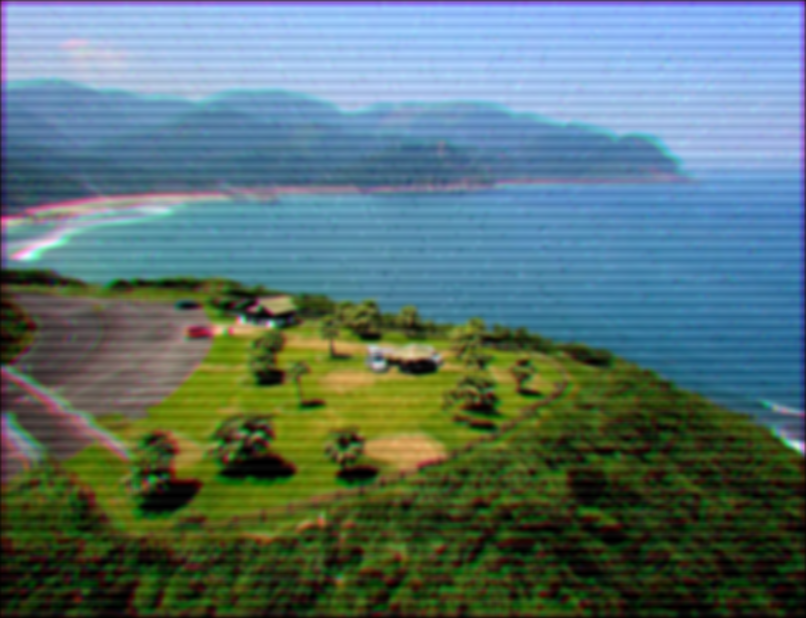
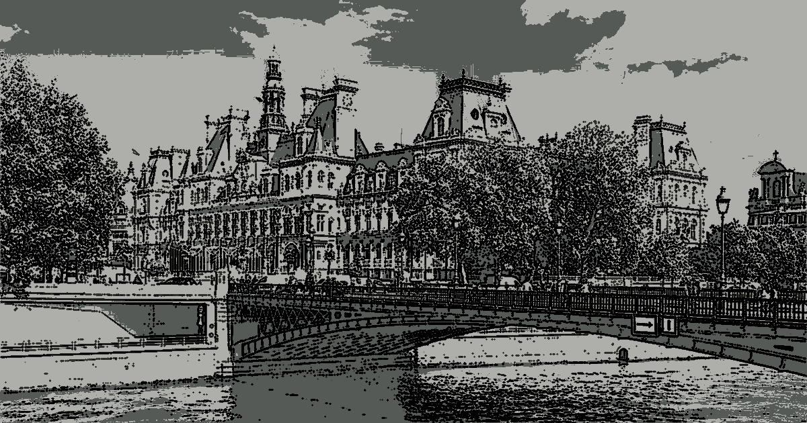

Artifo
==========
Filters and artistic effects

[![cpp version][shield-cpp]](#)
[![cuda version][shield-cuda]](#)
[![Build status][shield-build]](#)
[![Code coverage][shield-coverage]](#)
[![MIT licensed][shield-license]](#)

```sh
./artifo tv input/landscape.jpg
```



Table of Contents
-----------------

  * [Requirements](#requirements)
  * [Usage](#usage)
  * [Filters](#filters)
  * [Presentation](#presentation)
  * [License](#license)

Requirements
------------
*The versions correspond to the configuration tested on Ubuntu*

Artifo requires the following to run:
  * [GCC][gcc] 9.4.0
  * [GNU Make][make] 4.2.1
  
 Optionnal requirement for NVIDIA GPU support:
  * [NVIDIA CUDA (nvcc)][nvcc] 10.1

Usage
-----

In the root of the repository we first compile the files:

```sh
make
```

Or if you have CUDA installed:
```sh
make cuda
```

Then you can run a command line like:

```sh
./artifo cartoon input/bridge.jpg [1,10,1] false
```



*The parameter [1,10,1] means that the number of colors will vary from 1 to 10 with a step of 1. The output file is a gif.*

*Any numeric parameter can be substitued by a variation range but only one among the arguments*

Filters
-------

### Cartoon
```sh
./artifo cartoon <file_path/all> <nb_colors: int> <monochrom: bool>
```
`nb_colors:` Number of different colors

`monochrom:` Whether these colors are similar or not

### Dot
```sh
./artifo dot <file_path/all> <width: int> <is_crop: bool>
```
`width:` Number of dots in the width of the image

### Engraving
```sh
./artifo engraving <file_path/all>
```

### Glass
```sh
./artifo glass <file_path/all> <width: int> <grid: bool>
```
`width:` Number of tiles in the width of the image

### Honeycomb
```sh
./artifo honeycomb <file_path/all> <width: int> <is_crop: bool>
```
`width:` Number of cells in the width of the image

`is_crop:` Whether cells can be cut on the edges or not

### Pixel
```sh
./artifo pixel <file_path/all> <height: int> <divisions: int> <outline: bool>
```
`divisions:` Number of sub-pixels in mega pixels

`outline:` Laplacian of gaussian edges

### TV
```sh
./artifo tv <file_path/all>
```

Presentation
------------

The slides from the presentation of the 05/25/2022

[Link to the slides][presentation]

License
-------

Artifo is licensed under the [MIT](#) license.

Copyright &copy; 2022, Heloïse Fabre, Alexandre James

[presentation]: https://github.com/alexandre-james/artifo/raw/main/docs/presentation.pdf

[gcc]: https://gcc.gnu.org/
[make]: https://www.gnu.org/software/make/
[nvcc]: https://developer.nvidia.com/cuda-downloads


[shield-cpp]: https://img.shields.io/badge/C%2B%2B-17-blue
[shield-cuda]: https://img.shields.io/badge/CUDA-V10-blue
[shield-build]: https://img.shields.io/badge/build-passing-brightgreen
[shield-coverage]: https://img.shields.io/badge/coverage-100%25-brightgreen.svg
[shield-license]: https://img.shields.io/badge/license-MIT-blue.svg
